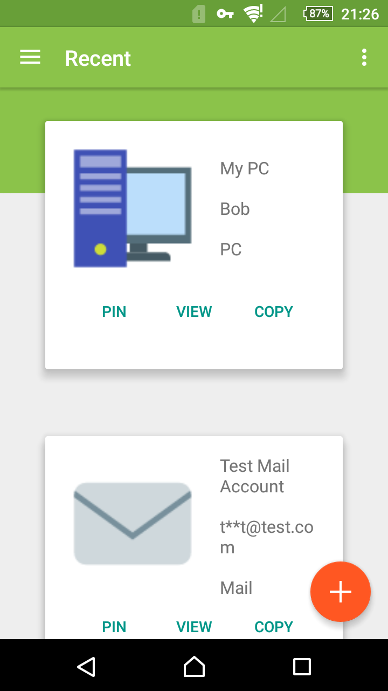
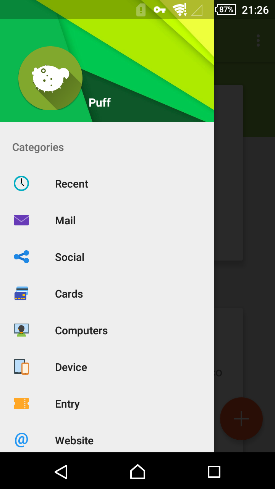
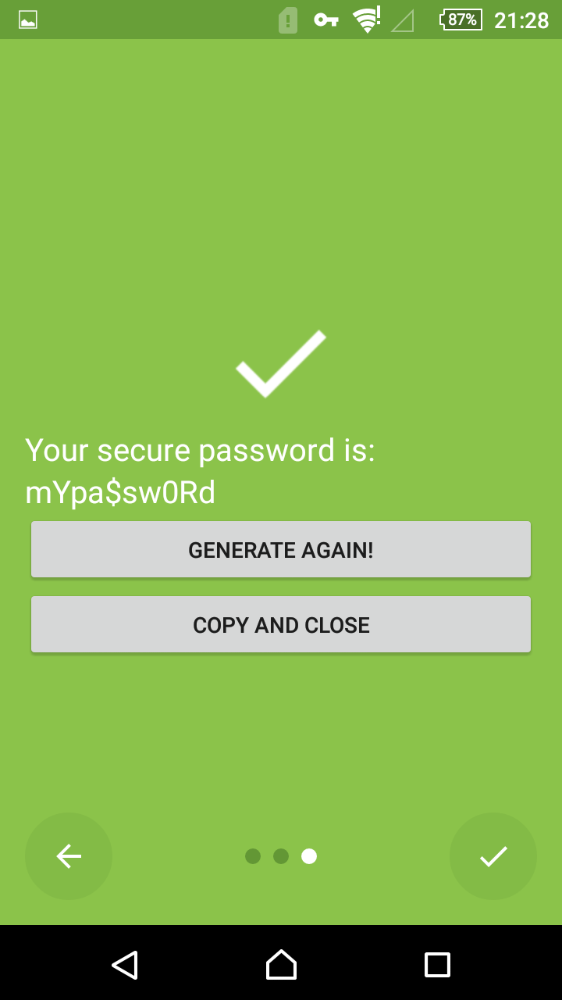
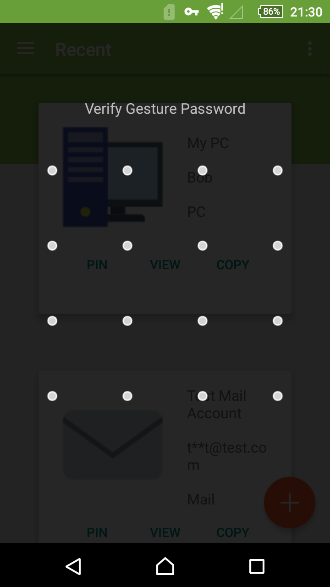
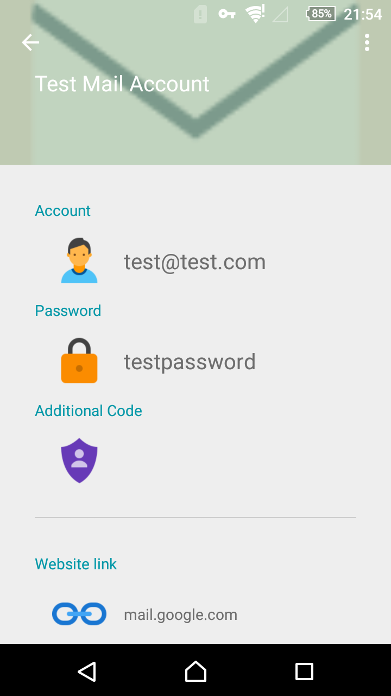
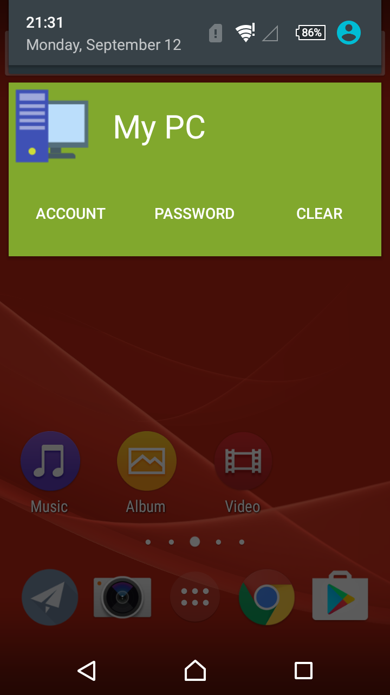
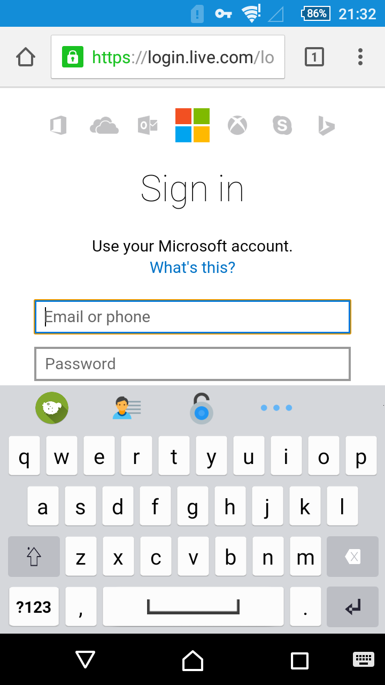
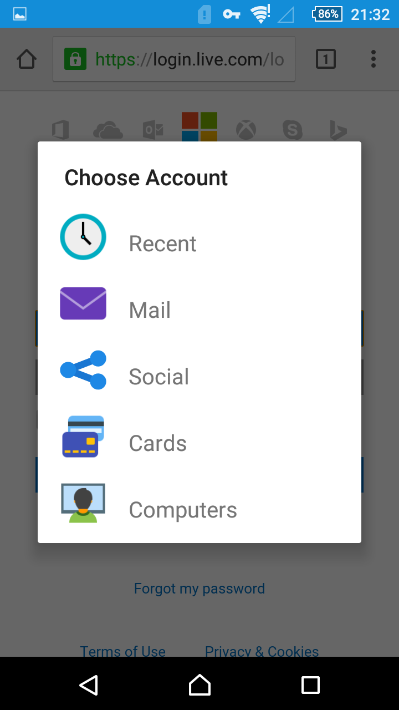

# Puff

Password Utility Free Forever

## Features

* Open Source
* **Blowfish Encryption**
* **Totally Offline** - we don't even require an internet access permission
* Quick access your credentials
* Cross Platform - Working in Progress

## Screenshots

|  |  |  |  |
| --------------------------------------- | ---------------------------------------- | ---------------------------------------- | ---------------------------------------- |
| Home                                    | Builtin Categories                       | Password Generator                       | Gesture Lock                             |

|  |  |  |  |
| ---------------------------------------- | ---------------------------------------- | ---------------------------------------- | ---------------------------------------- |
| View Detail                              | Pin to Notification                      | Puff Quick Access Keyboard               | Quick Access Dialog                      |

## How does it works ?

### Design Guideline

Like other password manager, Puff also use a master password for encryption & decryption. All your credentials are encrypted with it using `Blowfish Encryption`.

Puff's most important design guideline is we **DO NOT** upload your database to anywhere. Not to a cloud or self-hosted server. We **DO NOT** require internet permission in this app. All your credentials are in your local storage safely.

Second guideline is, we try to avoid store your master password, even if it's the encrypted. We need you enter your master password on demand. If you don't enable gesture lock, the app can never know your master password.

### Quick Access Tools

Puff provide two ways for quick access your account credentials.

* **Pin**

    Pin means pin your account information in a notification. As you can see in the screenshot, for each credential there is a button in the notification. Click that button the credential will be copied to your clipboard automatically. And the notification will be dissmissed in 1 minute.

* **Puff Secure Keyboard**

    Puff Secure Keyboard is a keyboard, aka input method. You can switch to it like other input method programs. The different between Puff keyboard and other IMEs is Puff keyboard can access your credential quickly. Just click on the blowfish icon and a dialog contains your account list will pop up. Select one and decrypt it with your master password. Then click the other three keys in Puff keyboard which stands for 'Account', 'Password' & 'Additional Field' which will auto fill the corresponding information for you.

## Roadmap

* Bug fix & UI tweaks on Android version
* Ship Android APP on GooglePlay
* Develop iOS version
* Develop Desktop version

## Credits

Icons in this app are brought you by [Icons8.com](https://icons8.com)

[Event Bus](https://github.com/greenrobot/EventBus)

[Green DAO](https://github.com/greenrobot/greenDAO)

[Scissors](https://github.com/lyft/scissors)

[AnimateCheckBox](https://github.com/hanks-zyh/AnimateCheckBox)

[Picasso](https://github.com/square/picasso)

[CircularReveal](https://github.com/ozodrukh/CircularReveal)

[Android-PatternView](https://github.com/geftimov/android-patternview)

[MaterialSettings](https://github.com/kenumir/MaterialSettings)

[Android-About-Page](https://github.com/medyo/android-about-page)

# Developers

[Bob Sun](https://github.com/SpongeBobSun)

[bigflower](https://github.com/mBigFlower)

## License

Puff is licensed under [MIT License](https://github.com/PuffOpenSource/Puff-Android/blob/master/LICENSE)
